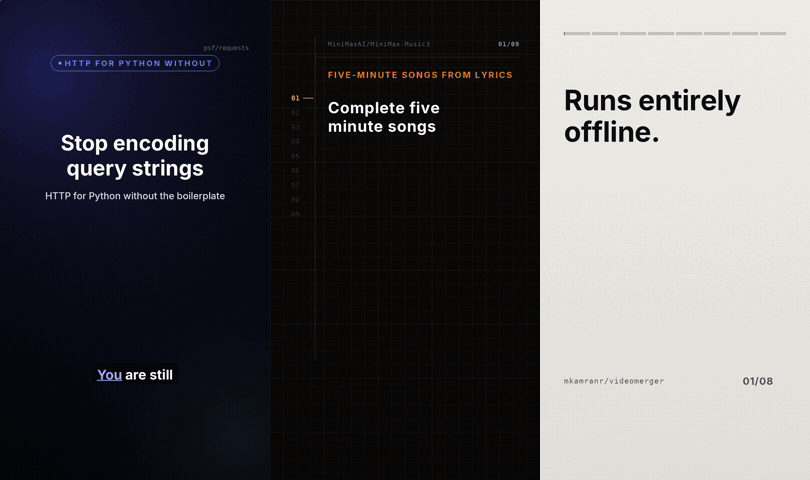

# ReelForge

[](docs/SETUP.md)
[](docs/ARCHITECTURE.md)
[](docs/SETUP.md)
[](docs/CONFIGURATION.md#generated-imagery-comfyui)
[](docs/CONFIGURATION.md#fish-speech-narration)
[](docs/CONFIGURATION.md#encode-settings--do-not-drift)
[](docs/CONFIGURATION.md)

Turn a GitHub repository or a Hugging Face model into a finished vertical reel —
video, cover art, and the per-platform copy that ships with it.

Paste a URL. The pipeline fetches the facts, writes the script, generates or
accepts the narration, aligns it to the audio, writes the storyboard, renders,
verifies the encode against what Instagram and YouTube actually require, and
hands you a bundle. Every stage is a reviewable artefact you can edit before the
next one runs.

One file serves Instagram Reels, YouTube Shorts and Facebook Reels:
**1080×1920 · 30 fps · H.264 High @ 4.1 · CRF 18 · AAC-LC 192 kbps · −14 LUFS**.



*Three finished reels, one per design language — Bloom, Ledger, Slab — each fully
generated from a URL: script, narration, AI stills and clips, music bed, cover.
Sped up ~4×.*

---

## Documentation

| | |
|---|---|
| **[docs/SETUP.md](docs/SETUP.md)** | Prerequisites, installation, fonts, first run |
| **[docs/USAGE.md](docs/USAGE.md)** | Running it — web UI, CLI, the queue, troubleshooting |
| **[docs/CONFIGURATION.md](docs/CONFIGURATION.md)** | Providers, model routing, API keys, approval gates |
| **[docs/ARCHITECTURE.md](docs/ARCHITECTURE.md)** | How it works inside |
| **[DEVELOPMENT.md](DEVELOPMENT.md)** | The renderer's own constraints, and the gotchas that cost real time |

---

## What it does

**Input:** a repository URL, and optionally a voice recording and some
screenshots.
**Output:** a finished `.mp4`, a cover `.png`, a caption block per platform, and
a verification report.

Ten stages, each writing a file you can open:

| Stage | What it does | Output |
|---|---|---|
| `ingest` | GitHub / Hugging Face API + README | `facts.json` |
| `content` | Script, narration phrases, fact sheet, cover spec, platform copy | `content.json`, `<slug>.txt` |
| `cover` | Cover art, rendered from the spec | `<slug>-reel.png` |
| `visuals` | Stills and a clip from the script's directions, via ComfyUI (optional) | `visuals/visuals.json` |
| `audio` | Synthesize per phrase, or accept an upload | `<slug>.mp3` |
| `align` | Narration → word-level timing | `build/<slug>.timing.json` |
| `storyboard` | Write the storyboard, then prove it renders | `storyboards/<slug>.py` |
| `render` | Chunked parallel render and encode | `<slug>-reel.mp4` |
| `verify` | 18 assertions against platform requirements | `verify.json`, `contact.png` |
| `package` | Delivery bundle | `out/`, `bundle.zip` |

A job is a directory. `data/jobs/<id>/job.json` is its state; every artefact sits
beside it as a file. There is no database.

Re-running a stage invalidates everything downstream — editing the script cannot
leave a video rendered from the previous one.

### What makes the output work

The retention rules are baked into the storyboards, not left to chance:

- **The hook is fully on screen at frame 0.** No logo intro, no fade up.
- **Captions are burned in and word-synced** — most feeds start muted. Optional
  per reel, since both platforms also auto-caption.
- **A cut every 2–4 seconds**, and an event every 1–2 seconds inside a longer hold.
- **Every visual beat is keyed to a spoken word**, never to a round number.
- **Safe areas are enforced**, including the platform action-button column that
  covers `x 960–1080, y 1000–1700`.

---

## Quick start

```bash
git clone <your-repo-url> reelforge && cd reelforge
cp .env.example .env                                    # fill in only what you use
docker compose -f docker/docker-compose.yml up --build
open http://localhost:8000/v2
```

Fully local, no API keys at all:

```bash
docker compose -f docker/docker-compose.yml \
  --profile local-llm --profile local-tts up --build
docker compose -f docker/docker-compose.yml exec ollama ollama pull qwen2.5:7b-instruct
```

Without Docker, for development — no Redis needed, stages run inline:

```bash
pip install -r requirements-dev.txt
./docker/fetch-fonts.sh
uvicorn app.main:app --workers 1 --reload
```

Then check the environment is actually sound:

```bash
python -m app.cli doctor
```

Full detail in **[docs/SETUP.md](docs/SETUP.md)**.

---

## Interfaces

Three ways in, all driving the same pipeline:

- **`/v2`** — the current web UI. Separate pages, no build step, no CDN, light
  and dark themes.
- **`/`** — the original single-file UI. Frozen, kept as a fallback.
- **`python -m app.cli`** — headless, for CI or for poking at a job inside the
  container.

---

## Reels queue and run one at a time

About 76% of a run is two LLM stages (`content` and `storyboard`, together
roughly 8.6 minutes of an 11.3-minute job). Two jobs at once is two workloads
against one GPU, so the scheduler runs exactly one job end to end.

Queue state lives in each job's own `job.json`, so it is rebuilt by scanning jobs
and **survives a restart with no recovery code**. You can reorder, cancel and
pause from the UI. Two consecutive failures pause the queue — that is a broken
model server, not two broken reels.

Run `uvicorn` with `--workers 1`.

---

## Project layout

```
app/                 the service
  api/               HTTP routes
  ingest/            GitHub + Hugging Face fact gathering
  models/            job, facts, content schemas
  prompts/           the prompt text for each generated artefact
  providers/         LLM and TTS adapters
  render/            workspace farm, shims, fonts, chunked render, verify
  stages/            the nine stages and the pipeline walker
  templates/         visual direction, one directory per template
  ui/                the original UI (frozen)
  ui_v2/             the current UI
  validate/          script, storyboard, cover and fact checks
video/               the renderer -- NOT modified by the app
  kit.py             canvas, palette, fonts, easing, drawing primitives
  align.py           audio -> phrase segments -> word-level timing
  sbkit.py           shared storyboard machinery (Bloom)
  ledger.py          the second design language (Ledger)
  slab.py            the third design language (Slab)
  covers.py          cover art, four example specs (one per layout)
  render.py          storyboard -> raw frames
  make.sh            align -> mix -> render -> encode -> verify
docker/              images and compose
docs/                this documentation
tests/               the test suite
```

### What is not version-controlled

This repository is the application, not the reels it produces.

`data/` (jobs, settings, API keys), `out/`, `video/build/` and `video/bin/` are
generated. So is every reel artefact — the scripts, the narration, the cover art,
the notes and the finished video. Job output belongs in `data/jobs/<id>/` and
`out/`, and a clone starts with none of it.

The four storyboards the templates use as worked examples are shipped in
`app/templates/examples/`. They are read as text and pasted into the prompt,
never imported, so they are application assets rather than reel output.

---

## Generated imagery (ComfyUI)

Optional. Point a **visuals** profile at a ComfyUI server and every reel also
gets pictures the image model drew: a still per body scene from its `ON SCREEN`
direction, one short clip from the scene with a shot description, and a
backdrop painted under the cover's typography. Two API-format workflows ship in
`app/workflows/` -- Qwen-Image 2512 for stills, LTX 2.5 text-to-video for
clips -- and the adapter rewrites their prompt, size, seed and duration nodes.
Off by default; with it off the pipeline is exactly what it was.

The same profile can carry a Stable Audio workflow for an optional music bed
under the narration and generated cut sounds -- music and effects, not speech.
For a self-hosted *voice*, a `fish` profile drives Fish-Speech's Gradio app.

Details in **[docs/CONFIGURATION.md](docs/CONFIGURATION.md#generated-imagery-comfyui)**.

---

## Templates

A template is a directory in `app/templates/`: palette hints, tone direction,
cover motif, and a worked example storyboard shown to the code-writing model.
Five ship:

`cool-indigo` · `warm-amber` · `editorial` · `research` · `safe-deterministic`

`safe-deterministic` skips code generation and renders from the content data
through fixed archetypes. It is also the automatic fallback when generation
exhausts its repair budget, so a job always produces a video.

---

## How generated storyboards are kept honest

The model writes a real Python module. Eight rungs decide whether it is worth
spending minutes of rendering on, cheapest first. Each failure becomes the repair
prompt.

| | Check |
|---|---|
| 1 | it parses |
| 2 | imports are on the allowlist; no `exec`, `open`, `subprocess` |
| 3 | the module contract, and `TOTAL` agrees with the narration |
| 4 | **every cue word was actually spoken** |
| 5 | the scene table is contiguous and paced |
| 6 | sample frames render, in a limited subprocess |
| 7 | nothing legible sits under the platform UI |
| 8 | optionally, a multimodal model looks at the frames |

Rung 4 earns its keep. `Timing.ws()` raises on an unknown word — deliberately, so
a typo is never a silent mistiming — and the likeliest mistake a model makes is
naming a word that was never spoken. Catching it statically costs milliseconds;
catching it at render time costs a full repair round. The check suggests the
nearest real word.

**The sandbox contains buggy code, not hostile code.** Resource limits and an
import allowlist are defence in depth against a bad loop, not a boundary against
an adversary. For that, run the renderer with no network and a read-only root.

---

## What this does not do

- **No publishing.** It produces assets and metadata; you post them. No OAuth, no
  platform app review.
- **One aspect ratio.** 1080×1920 serves Reels, Shorts and Facebook Reels. Only
  the copy differs per platform.
- **Fonts differ from the reels already in this repo**, which were built with
  Helvetica Neue. Inter is close, not identical.
- **Uploaded human narration may still need you.** When the phrase count cannot
  be reconciled with what the voice actually did, the UI shows the detected
  segments beside the phrase lines and asks you to split or merge. That is a
  judgement call about where a sentence ended, and guessing it silently would be
  worse than asking.
